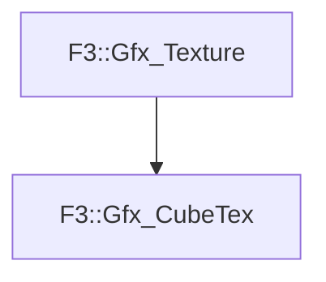

# F3::Gfx_CubeTex

[Return to `F3`](/docs/F3.md)

## C++

- [`Gfx_CubeTex.hpp`](/c++/include/Gfx_CubeTex.hpp)
- [`Gfx_CubeTex.cpp`](/c++/source/Gfx_CubeTex.cpp)

## References

- [`F3::Gfx_Texture`](/docs/F3/Gfx_Texture.md)

## Inheritance

[Return to `F3`](/docs/F3.md)