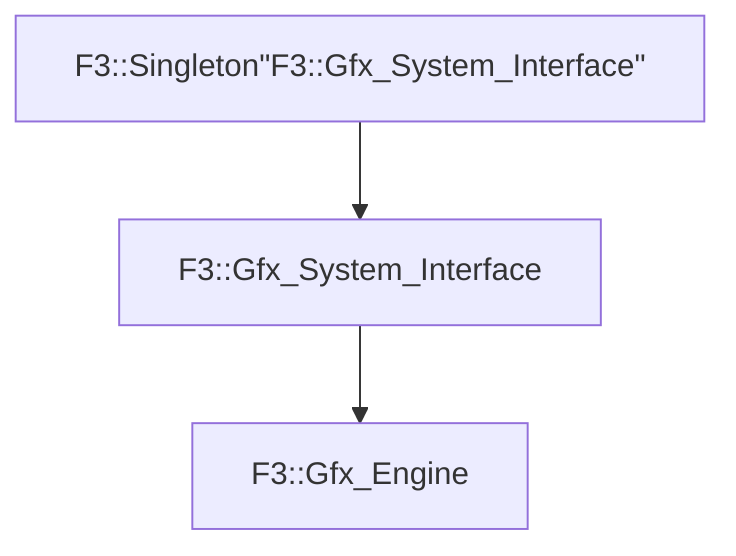

# F3::Gfx_Engine

[Return to `F3`](/docs/F3.md)

## C++

- [`Gfx_Engine.hpp`](/c++/include/Gfx_Engine.hpp)
- [`Gfx_Engine.cpp`](/c++/source/Gfx_Engine.cpp)

## References

- [`F3::Singleton`](/docs/F3/Singleton.md)
- [`F3::Gfx_System_Interface`](/docs/F3/Gfx_System_Interface.md)

## Inheritance

[Return to `F3`](/docs/F3.md)