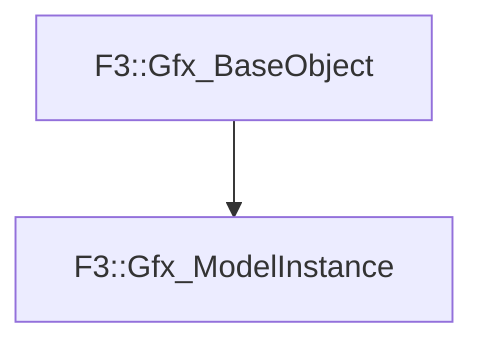

# F3::Gfx_ModelInstance

[Return to `F3`](/docs/F3.md)

## C++

- [`Gfx_ModelInstance.hpp`](/c++/include/Gfx_ModelInstance.hpp)
- [`Gfx_ModelInstance.cpp`](/c++/source/Gfx_ModelInstance.cpp)

## References

- [`F3::Gfx_BaseObject`](/docs/F3/Gfx_BaseObject.md)

## Inheritance

[Return to `F3`](/docs/F3.md)