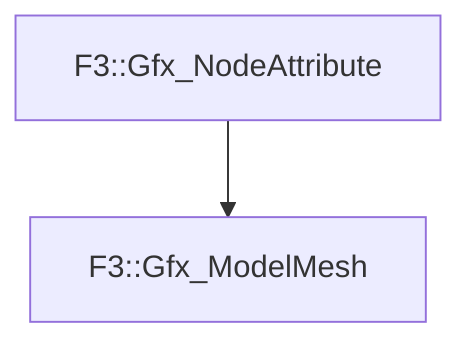

# F3::Gfx_ModelMesh

[Return to `F3`](/docs/F3.md)

## C++

- [`Gfx_ModelMesh.hpp`](/c++/include/Gfx_ModelMesh.hpp)
- [`Gfx_ModelMesh.cpp`](/c++/source/Gfx_ModelMesh.cpp)

## References

- [`F3::Gfx_NodeAttribute`](/docs/F3/Gfx_NodeAttribute.md)

## Inheritance

[Return to `F3`](/docs/F3.md)