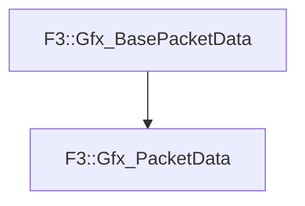

# F3::Gfx_PacketData

[Return to `F3`](/docs/F3.md)

## C++

- [`Gfx_PacketData.hpp`](/c++/include/Gfx_PacketData.hpp)
- [`Gfx_PacketData.cpp`](/c++/source/Gfx_PacketData.cpp)

## References

- [`F3::Gfx_BasePacketData`](/docs/F3/Gfx_BasePacketData.md)

## Inheritance

[Return to `F3`](/docs/F3.md)