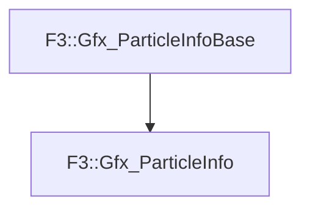

# F3::Gfx_ParticleInfo

[Return to `F3`](/docs/F3.md)

## C++

- [`Gfx_ParticleInfo.hpp`](/c++/include/Gfx_ParticleInfo.hpp)
- [`Gfx_ParticleInfo.cpp`](/c++/source/Gfx_ParticleInfo.cpp)

## References

- [`F3::Gfx_ParticleInfoBase`](/docs/F3/Gfx_ParticleInfoBase.md)

## Inheritance

[Return to `F3`](/docs/F3.md)