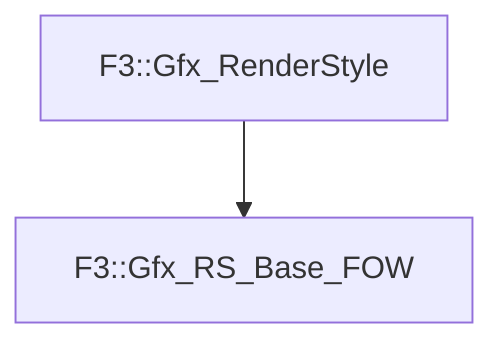

# F3::Gfx_RS_Base_FOW

[Return to `F3`](/docs/F3.md)

## C++

- [`Gfx_RS_Base_FOW.hpp`](/c++/include/Gfx_RS_Base_FOW.hpp)
- [`Gfx_RS_Base_FOW.cpp`](/c++/source/Gfx_RS_Base_FOW.cpp)

## References

- [`F3::Gfx_RenderStyle`](/docs/F3/Gfx_RenderStyle.md)

## Inheritance

[Return to `F3`](/docs/F3.md)