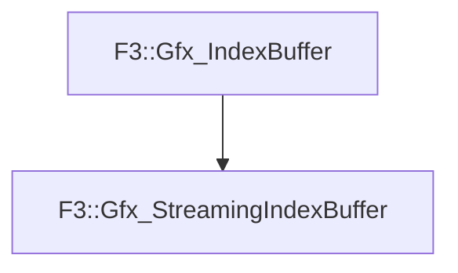

# F3::Gfx_StreamingIndexBuffer

[Return to `F3`](/docs/F3.md)

## C++

- [`Gfx_StreamingIndexBuffer.hpp`](/c++/include/Gfx_StreamingIndexBuffer.hpp)
- [`Gfx_StreamingIndexBuffer.cpp`](/c++/source/Gfx_StreamingIndexBuffer.cpp)

## References

- [`F3::Gfx_IndexBuffer`](/docs/F3/Gfx_IndexBuffer.md)

## Inheritance

[Return to `F3`](/docs/F3.md)