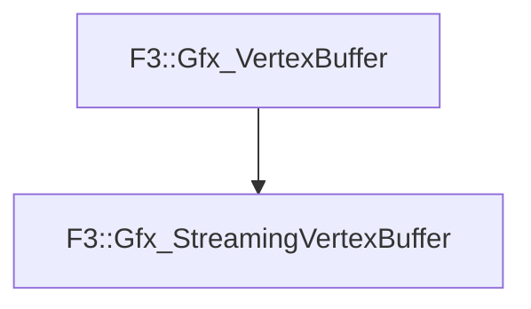

# F3::Gfx_StreamingVertexBuffer

[Return to `F3`](/docs/F3.md)

## C++

- [`Gfx_StreamingVertexBuffer.hpp`](/c++/include/Gfx_StreamingVertexBuffer.hpp)
- [`Gfx_StreamingVertexBuffer.cpp`](/c++/source/Gfx_StreamingVertexBuffer.cpp)

## References

- [`F3::Gfx_VertexBuffer`](/docs/F3/Gfx_VertexBuffer.md)

## Inheritance

[Return to `F3`](/docs/F3.md)