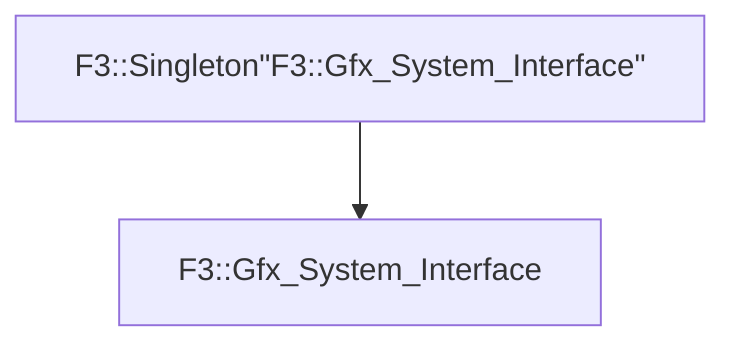

# F3::Gfx_System_Interface

[Return to `F3`](/docs/F3.md)

## C++

- [`Gfx_System_Interface.hpp`](/c++/include/Gfx_System_Interface.hpp)
- [`Gfx_System_Interface.cpp`](/c++/source/Gfx_System_Interface.cpp)

## References

- [`F3::Singleton`](/docs/F3/Singleton.md)

## Inheritance

[Return to `F3`](/docs/F3.md)