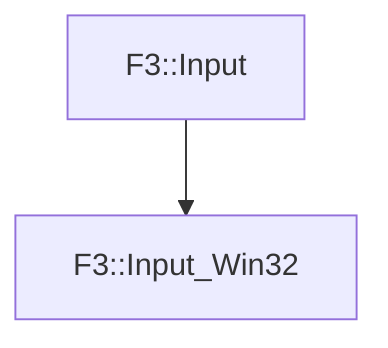

# F3::Input_Win32

[Return to `F3`](/docs/F3.md)

## C++

- [`Input_Win32.hpp`](/c++/include/Input_Win32.hpp)
- [`Input_Win32.cpp`](/c++/source/Input_Win32.cpp)

## References

- [`F3::Input`](/docs/F3/Input.md)

## Inheritance

[Return to `F3`](/docs/F3.md)