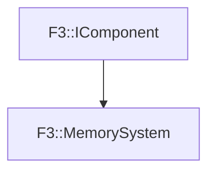

# F3::MemorySystem

[Return to `F3`](/docs/F3.md)

## C++

- [`MemorySystem.hpp`](/c++/include/MemorySystem.hpp)
- [`MemorySystem.cpp`](/c++/source/MemorySystem.cpp)

## References

- [`F3::IComponent`](/docs/F3/IComponent.md)

## Inheritance

[Return to `F3`](/docs/F3.md)