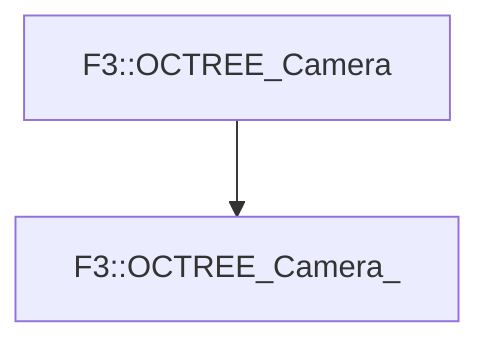

# F3::OCTREE_Camera_

[Return to `F3`](/docs/F3.md)

## C++

- [`OCTREE_Camera_.hpp`](/c++/include/OCTREE_Camera_.hpp)
- [`OCTREE_Camera_.cpp`](/c++/source/OCTREE_Camera_.cpp)

## References

- [`F3::OCTREE_Camera`](/docs/F3/OCTREE_Camera.md)

## Inheritance

[Return to `F3`](/docs/F3.md)