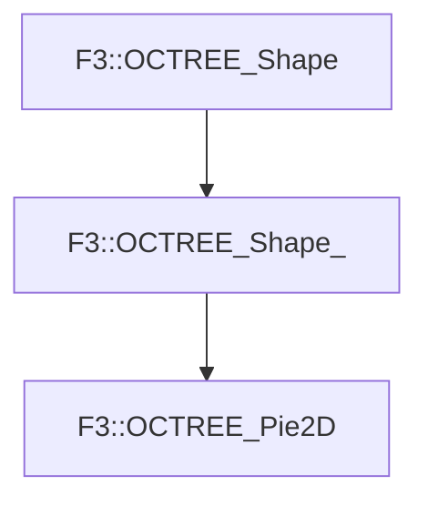

# F3::OCTREE_Pie2D

[Return to `F3`](/docs/F3.md)

## C++

- [`OCTREE_Pie2D.hpp`](/c++/include/OCTREE_Pie2D.hpp)
- [`OCTREE_Pie2D.cpp`](/c++/source/OCTREE_Pie2D.cpp)

## References

- [`F3::OCTREE_Shape`](/docs/F3/OCTREE_Shape.md)
- [`F3::OCTREE_Shape_`](/docs/F3/OCTREE_Shape_.md)

## Inheritance

[Return to `F3`](/docs/F3.md)