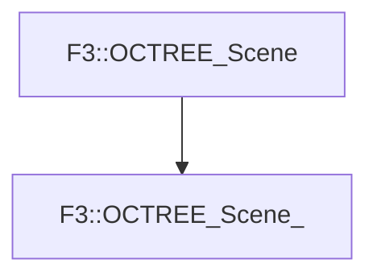

# F3::OCTREE_Scene_

[Return to `F3`](/docs/F3.md)

## C++

- [`OCTREE_Scene_.hpp`](/c++/include/OCTREE_Scene_.hpp)
- [`OCTREE_Scene_.cpp`](/c++/source/OCTREE_Scene_.cpp)

## References

- [`F3::OCTREE_Scene`](/docs/F3/OCTREE_Scene.md)

## Inheritance

[Return to `F3`](/docs/F3.md)