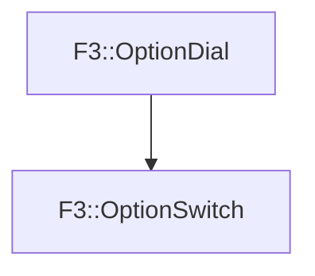

# F3::OptionSwitch

[Return to `F3`](/docs/F3.md)

## C++

- [`OptionSwitch.hpp`](/c++/include/OptionSwitch.hpp)
- [`OptionSwitch.cpp`](/c++/source/OptionSwitch.cpp)

## References

- [`F3::OptionDial`](/docs/F3/OptionDial.md)

## Inheritance

[Return to `F3`](/docs/F3.md)