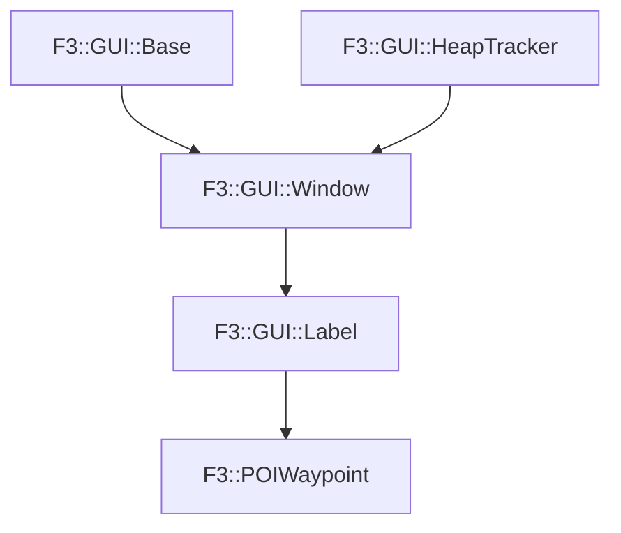

# F3::POIWaypoint

[Return to `F3`](/docs/F3.md)

## C++

- [`POIWaypoint.hpp`](/c++/include/POIWaypoint.hpp)
- [`POIWaypoint.cpp`](/c++/source/POIWaypoint.cpp)

## References

- [`F3::GUI::Base`](/docs/F3/GUI/Base.md)
- [`F3::GUI::HeapTracker`](/docs/F3/GUI/HeapTracker.md)
- [`F3::GUI::Window`](/docs/F3/GUI/Window.md)
- [`F3::GUI::Label`](/docs/F3/GUI/Label.md)

## Inheritance

[Return to `F3`](/docs/F3.md)