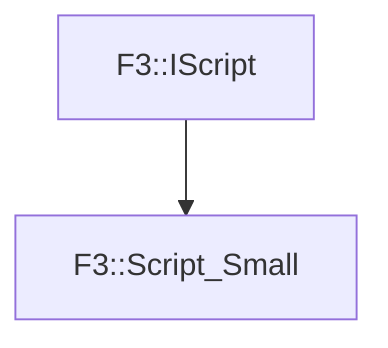

# F3::Script_Small

[Return to `F3`](/docs/F3.md)

## C++

- [`Script_Small.hpp`](/c++/include/Script_Small.hpp)
- [`Script_Small.cpp`](/c++/source/Script_Small.cpp)

## References

- [`F3::IScript`](/docs/F3/IScript.md)

## Inheritance

[Return to `F3`](/docs/F3.md)