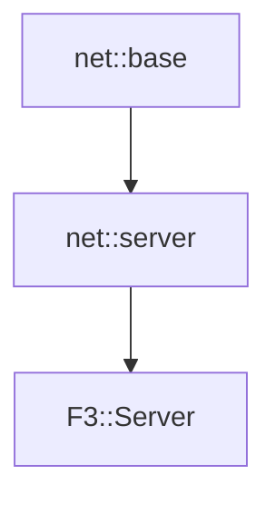

# F3::Server

[Return to `F3`](/docs/F3.md)

## C++

- [`Server.hpp`](/c++/include/Server.hpp)
- [`Server.cpp`](/c++/source/Server.cpp)

## References

- [`net::base`](/docs/net/base.md)
- [`net::server`](/docs/net/server.md)

## Inheritance

[Return to `F3`](/docs/F3.md)