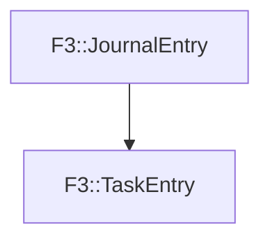

# F3::TaskEntry

[Return to `F3`](/docs/F3.md)

## C++

- [`TaskEntry.hpp`](/c++/include/TaskEntry.hpp)
- [`TaskEntry.cpp`](/c++/source/TaskEntry.cpp)

## References

- [`F3::JournalEntry`](/docs/F3/JournalEntry.md)

## Inheritance

[Return to `F3`](/docs/F3.md)