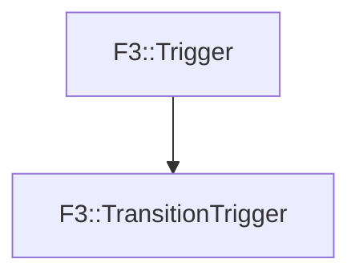

# F3::TransitionTrigger

[Return to `F3`](/docs/F3.md)

## C++

- [`TransitionTrigger.hpp`](/c++/include/TransitionTrigger.hpp)
- [`TransitionTrigger.cpp`](/c++/source/TransitionTrigger.cpp)

## References

- [`F3::Trigger`](/docs/F3/Trigger.md)

## Inheritance

[Return to `F3`](/docs/F3.md)