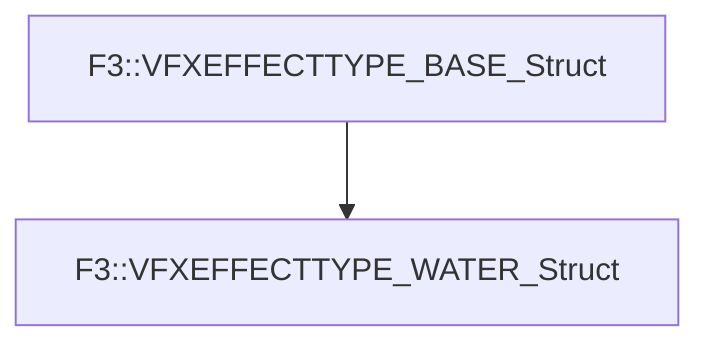

# F3::VFXEFFECTTYPE_WATER_Struct

[Return to `F3`](/docs/F3.md)

## C++

- [`VFXEFFECTTYPE_WATER_Struct.hpp`](/c++/include/VFXEFFECTTYPE_WATER_Struct.hpp)
- [`VFXEFFECTTYPE_WATER_Struct.cpp`](/c++/source/VFXEFFECTTYPE_WATER_Struct.cpp)

## References

- [`F3::VFXEFFECTTYPE_BASE_Struct`](/docs/F3/VFXEFFECTTYPE_BASE_Struct.md)

## Inheritance

[Return to `F3`](/docs/F3.md)