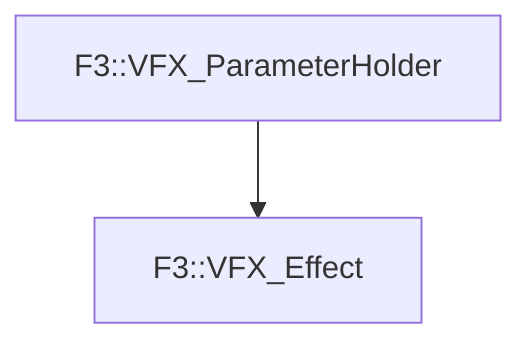

# F3::VFX_Effect

[Return to `F3`](/docs/F3.md)

## C++

- [`VFX_Effect.hpp`](/c++/include/VFX_Effect.hpp)
- [`VFX_Effect.cpp`](/c++/source/VFX_Effect.cpp)

## References

- [`F3::VFX_ParameterHolder`](/docs/F3/VFX_ParameterHolder.md)

## Inheritance

[Return to `F3`](/docs/F3.md)