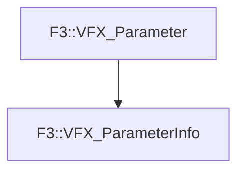

# F3::VFX_ParameterInfo

[Return to `F3`](/docs/F3.md)

## C++

- [`VFX_ParameterInfo.hpp`](/c++/include/VFX_ParameterInfo.hpp)
- [`VFX_ParameterInfo.cpp`](/c++/source/VFX_ParameterInfo.cpp)

## References

- [`F3::VFX_Parameter`](/docs/F3/VFX_Parameter.md)

## Inheritance

[Return to `F3`](/docs/F3.md)