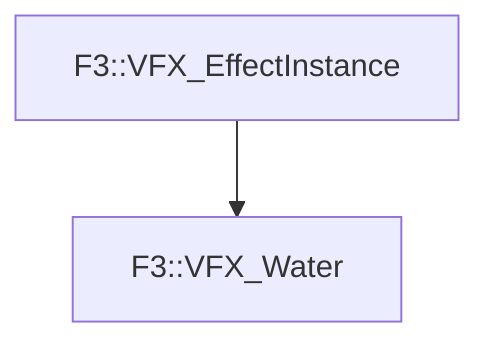

# F3::VFX_Water

[Return to `F3`](/docs/F3.md)

## C++

- [`VFX_Water.hpp`](/c++/include/VFX_Water.hpp)
- [`VFX_Water.cpp`](/c++/source/VFX_Water.cpp)

## References

- [`F3::VFX_EffectInstance`](/docs/F3/VFX_EffectInstance.md)

## Inheritance

[Return to `F3`](/docs/F3.md)