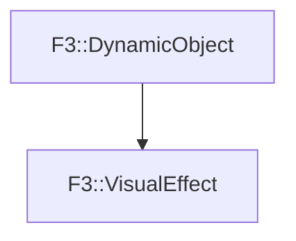

# F3::VisualEffect

[Return to `F3`](/docs/F3.md)

## C++

- [`VisualEffect.hpp`](/c++/include/VisualEffect.hpp)
- [`VisualEffect.cpp`](/c++/source/VisualEffect.cpp)

## References

- [`F3::DynamicObject`](/docs/F3/DynamicObject.md)

## Inheritance

[Return to `F3`](/docs/F3.md)