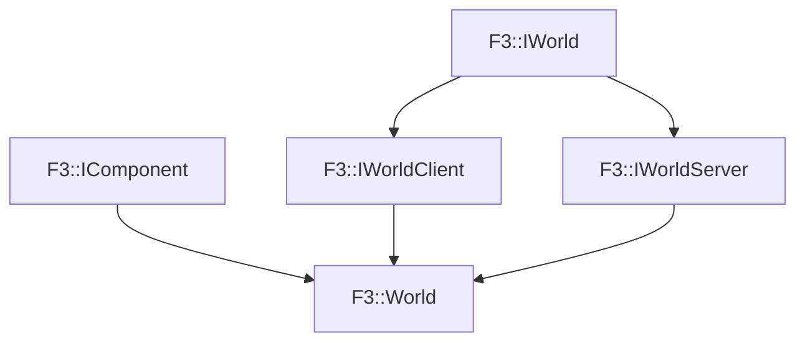

# F3::World

[Return to `F3`](/docs/F3.md)

## C++

- [`World.hpp`](/c++/include/World.hpp)
- [`World.cpp`](/c++/source/World.cpp)

## References

- [`F3::IWorld`](/docs/F3/IWorld.md)
- [`F3::IComponent`](/docs/F3/IComponent.md)
- [`F3::IWorldClient`](/docs/F3/IWorldClient.md)
- [`F3::IWorldServer`](/docs/F3/IWorldServer.md)

## Inheritance

[Return to `F3`](/docs/F3.md)