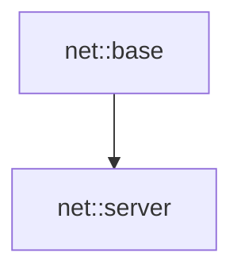

# net::server

[Return to `net`](/docs/net.md)

## References

- [`net::base`](/docs/net/base.md)

## Inheritance

```mermaid
graph TD;
    net::base --> net::server
```

[Return to `net`](/docs/net.md)